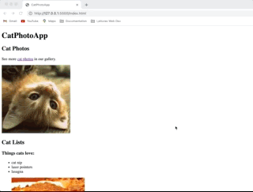

# CAT PHOTOS APP

The application was built as a practice project for a responsive web design course with FreecodeCamp. It features cat related content :smile_cat: and a form with different types of input.

## Features

- Images, lists and links for cat related content
- Form with radio, checkbox inputs
- Input text box
- Attributes added to form elements to facilitate reading through screen readers

## Technologies

- HTML

## Start the App

In the project directory, you can run it with the Live Server by right-clicking on the index.html.

It will run the app in the development mode.\
Open [http://127.0.0.1:5500](http://127.0.0.1:5500/index.html) to view it in your browser.

When making changes, make sure you reload to see it on the page.

### Author

[Tanimara Elias Santos](https://github.com/tanimaraeliassantos)

### Version

1.0.0
